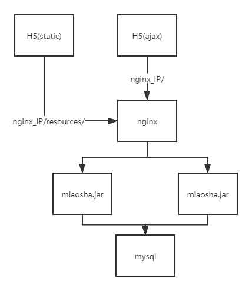
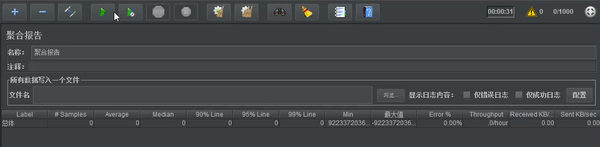
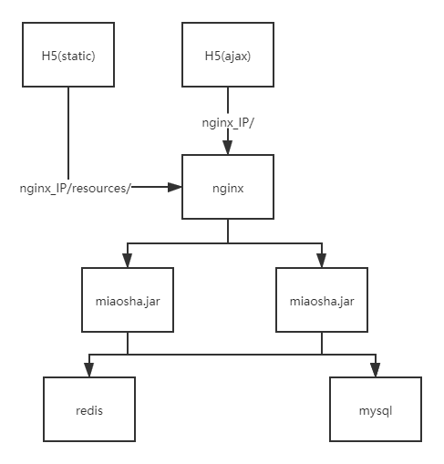
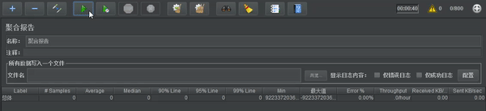
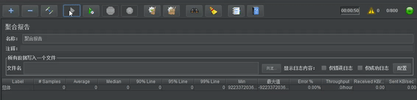
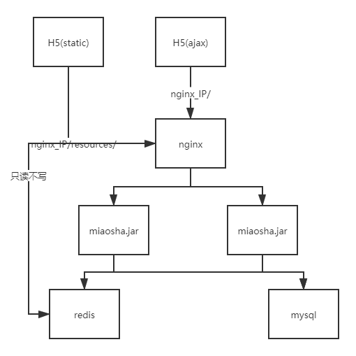
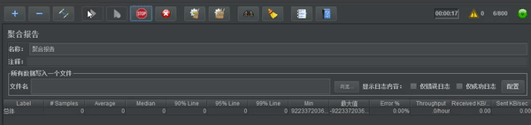

# 项目说明

该项目为自研《秒杀系统优化》项目，主要关注在性能优化方面：

- 技术栈：Spring Boot、rocketmq、Redis
- 优化点：
  - 硬件部署及配置优化
    - 云端部署
      - tomcat容器参数优化
      - keepalive优化
    - 分布式扩展
      - 水平扩展优化
      - 动静分离优化
      - 反向代理优化
      - 分布式会话优化
  - 过载保护优化
    - 流量削峰
      - 令牌分离优化
      - 闸门流量化
      - 队列泄洪
    - 防刷限流
      - 验证码优化
      - 令牌桶限流
  - 查询优化
    - redis缓存优化
    - 本地缓存优化
    - lua缓存优化
  - 交易优化
    - 交易验证优化
    - 缓存库存优化
    - 异步流程优化
    - 事务消息优化
    - 库存售罄优化

# 代码结构

- config：保存的是redis配置、tomcat的优化配置
- controller：控制器
- dao：mapper接口
- dataobject：do域对象
- error：错误管理对象
- mq：消息队列
- response：返回的封装对象
- serializer：序列化配置
- service：服务层
- util：验证码工具类
- valtdator：返回前端页面

# 未做任何优化前的TPS测试

- 服务器配置
  - 处理器、内存、网络：1 vCPU 2 GiB、1Mbps
  - 线程组数：
    - 线程数：500
    - 循环次数：20


从图中可以看到，在500个线程数单机`tps`只有`219.3/sec`的吞吐量（这个吞吐量还会更低），同时已经出现请求错误的现象。

# 硬件部署及配置优化

### tomcat容器参数优化

- 修改应用中的`application.properties`

```shell
# 等待队列长度
server.tomcat.accpet-count=1000
# 最大工作线程数
server.tomcat.max-threads=800
# 最小工作线程数
server.tomcat.min-spare-threads=100
```

- 线程组数
  - 线程数：500
  - 循环次数：20


通过修改了配置之后，终于把错误率消灭掉，但是程序的`tps`仍然很低，只有`161.9/sec`。

### keepalive优化

为了能够将每次循环的请求不是立刻断开，而是沿用原来的tcp连接，可以在jmeter的请求中，打开`KeepAlive`配置。同时要注意过长的时间连接，所以服务端需要设置连接的最大请求数和不响应后多少秒断开keepalive连接，相应的代码如下：

```java
//当Spring容器内没有TomcatEmbeddedServletContainerFactory这个bean时，会吧此bean加载进spring容器中
@Component
public class WebServerConfiguration implements WebServerFactoryCustomizer<ConfigurableWebServerFactory>
{
    @Override
    public void customize(ConfigurableWebServerFactory configurableWebServerFactory)     {
        //使用对应工厂类提供给我们的接口定制化我们的tomcat connector
        ((TomcatServletWebServerFactory)configurableWebServerFactory)
                .addConnectorCustomizers(new TomcatConnectorCustomizer() {
                    @Override
                    public void customize(Connector connector) {

                        Http11NioProtocol protocol = (Http11NioProtocol) connector.getProtocolHandler();
                        //定制化keepalivetimeout,设置30秒内没有请求则服务端自动断开keepalive链接
                        protocol.setKeepAliveTimeout(30000);
                        //当客户端发送超过10000个请求则自动断开keepalive链接
                        protocol.setMaxKeepAliveRequests(10000);

                    }
                });
    }
}
```

### 水平扩展优化



- 部署

  - 假设`nginx_IP`、`miao1_IP`、`miao2_IP`、`mysql_IP`代表不同的主机。
  
  - 并在`nginx_IP`、`miao1_IP`、`miao2_IP`创建`/var/www`的目录。
  
- 通过maven打包`miaosha.jar`，并上传到`miao1_IP`、`miao2_IP`的`/var/www/miaosha`目录中。
  
  - 同时修改外置`application.properties`对应的`msyql`连接为`mysql_IP`。
  
    ```shell
    # 修改数据连接
    spring.datasource.url=jdbc:mysql://***.***.***.***(mysql_IP):3306/miaosha?useUnicode=true&characterEncoding=UTF-8
    # 修改密码
    spring.datasource.password=****
    ```
  
  - 在`nginx_IP`安装`openresty`，同时将`html`的内容放到nginx的`html`目录下，并且解压`static.zip`，得到需要的静态文件资源，同时修改`conf/nginx.conf`文件，添加静态资源映射，这也是**动静分离优化**的操作的一种
  
    ```shell
    # http下配置要代理的服务器
    upstream backend_server{
       server ***.***.***.***(miao1_IP) weight=1;
       server ***.***.***.***(miao2_IP) weight=1;
       keepalive 30; #长链接时间
    }
    # server下静态资源配置
    location /resources/
    {
        alias /usr/local/openresty/nginx/html/resources/; #路径根据自己放的位置修改
        index  index.html index.htm;
    }
    
    # server下动态资源配置
    location / {
         # nginx处理的时候，会反向代理道对应的服务器上
         proxy_pass http://backend_server;
         #proxy_cache tmp_cache; # keys_zone 将这个作为这里的反向代理配置
         #proxy_cache_key $uri;
         #proxy_cache_valid 200 206 304 302 7d; #返回这些状态码的时候才缓存
         #proxy_set_header Host $http_host:$proxy_port;
         proxy_set_header Host $http_host;
         proxy_set_header X-Real-IP $remote_addr; #真正的地址是远端的地址，否则会拿到的是nginx的地址
         proxy_set_header X-Forwarded-For $proxy_add_x_forwarded_for; #nginx作为代理服务器，转发了请求
         proxy_http_version 1.1; #使用http1.1协议
         proxy_set_header Connection ""; #默认使用keepalive
    }
    ```
  
  - 同时在`miao1_IP`，`miao2_IP`的外置`application.properties`可开启访问日志
  
    ```shell
    #开启访问日志
    server.tomcat.accesslog.enabled=true 
    #日志存放的位置
    server.tomcat.accesslog.directory=/var/www/miaosha/tomcat 
    #日志记录的格式
    server.tomcat.accesslog.pattern=%h %l %u %t "%r" %s %b %D 
    ```
  

- 服务器配置

  - `nginx_IP`

    - 处理器、内存、网络：1 vCPU 1 GiB、5Mbps

  - `miao1_IP`、`miao2_IP`

    - 处理器、内存、网络：1 vCPU 1 GiB、5Mbps

  - `mysql_IP`

    - 处理器、内存、网络：1 vCPU 2 GiB 、1Mbps

  - 线程组

    - 线程数：800
    - 循环次数：20

    

从中可以看到，`tps`终于可以达道`845.4/sec`，但是最大得瓶颈还是在sql端，这个位置会很影响数据的传输。

# 查询优化

### redis缓存优化



- 第一个优化方案，首先将商品信息，提到redis库中，尽量靠近上游。

  ```java
      @RequestMapping(value = "/get",method = {RequestMethod.GET})
      @ResponseBody
      public CommonReturnType getItem(@RequestParam(name = "id")Integer id)
      {
          // 先查询有没有对应商品的缓存
          ItemModel itemModel = (ItemModel) redisTemplate.opsForValue().get("item_"+id);
  
          // 没有就查询数据库
          if(itemModel == null){
              itemModel = itemService.getItemById(id);
              //设置 缓存置入 到redis内
              redisTemplate.opsForValue().set("item_"+id,itemModel);
              redisTemplate.expire("item_"+id,10, TimeUnit.MINUTES);
          }
  
          ItemVO itemVO = convertVOFromModel(itemModel);
  
          return CommonReturnType.create(itemVO);
  
      }
  ```

- 线程组：

  - 线程数：800

  - 循环次数：20

    

加了redis缓存，但是效果还是部室特别明显，可能和网络关系等仍然有关，这次的优化的`tps`只有`835.6/sec`，相对于水平扩展，倒是没有错误率了，同时这里开始数据**不会保持一致性**了。

### 本地缓存化

- 第二个优化方案是使用guava进行本地缓存，将缓存提到jvm中，形成多级缓存。

  ```java
      //商品详情页浏览
      @RequestMapping(value = "/get",method = {RequestMethod.GET})
      @ResponseBody
      public CommonReturnType getItem(@RequestParam(name = "id")Integer id){
          ItemModel itemModel = null;
  
          //先取本地缓存
          itemModel = (ItemModel) cacheService.getFromCommonCache("item_"+id);
  
          if(itemModel == null){
              //根据商品的id到redis内获取
              itemModel = (ItemModel) redisTemplate.opsForValue().get("item_"+id);
  
              //若redis内不存在对应的itemModel,则访问下游service
              if(itemModel == null){
                  itemModel = itemService.getItemById(id);
                  //设置itemModel到redis内
                  redisTemplate.opsForValue().set("item_"+id,itemModel);
                  redisTemplate.expire("item_"+id,10, TimeUnit.MINUTES);
              }
              //填充本地缓存
              cacheService.setCommonCache("item_"+id,itemModel);
          }
  
          ItemVO itemVO = convertVOFromModel(itemModel);
          return CommonReturnType.create(itemVO);
      }
  ```

- 线程组：

  - 线程数：800
  - 循环次数：20

  

这次优化相对而言，又有一定得性能提升了，还是jvm本地缓存比较直接，`tps`达到了`851.4/sec`。

### lua缓存优化



- 首先在`/usr/local/openresty/lua`的目录下编写`itemredis.lua`脚本，其实就是让nginx直接从redis获取结果，返回给前端

  ```shell
  # 首先从请求的link上获取参数
  local args = ngx.req.get_uri_args()
  # 获取对应的id参数
  local id = args["id"]
  # 引入redis的模块
  local redis = require "resty.redis"
  # 新建缓存
  local cache = redis:new()
  # 连接redis
  local ok,err = cache:connect("***.***.***.***",6379)
  # 如果有对应的缓存
  local item_model = cache:get("item_"..id)
  # 如果不存在，就请求
  if item_model == ngx.null or item_model == nil then
          # 缓存对应的对象
          local resp = ngx.location.capture("/item/get?id="..id) 
          # 得到相应
          item_model = resp.body
  end
  # 返回对应的缓存结果
  ngx.say(item_model)
  ```

- 配置`nginx.conf`

  ```shell
  location /luaitem/get{
      default_type "application/json";
      #需要在redis中添加这一行
      content_by_lua_file ../lua/itemredis.lua;
  }
  ```

- 线程组：

  - 线程数：800

  - 循环次数：20

    

果然，越靠近用户的上游，越容易达到一个好的峰值。这次的优化的`tps`简单冲破`959.8/sec`，这比路由过去服务器来得更加及时。

# 关键代码解释

- [RedisConfig](./md/RdisConfig.md)

