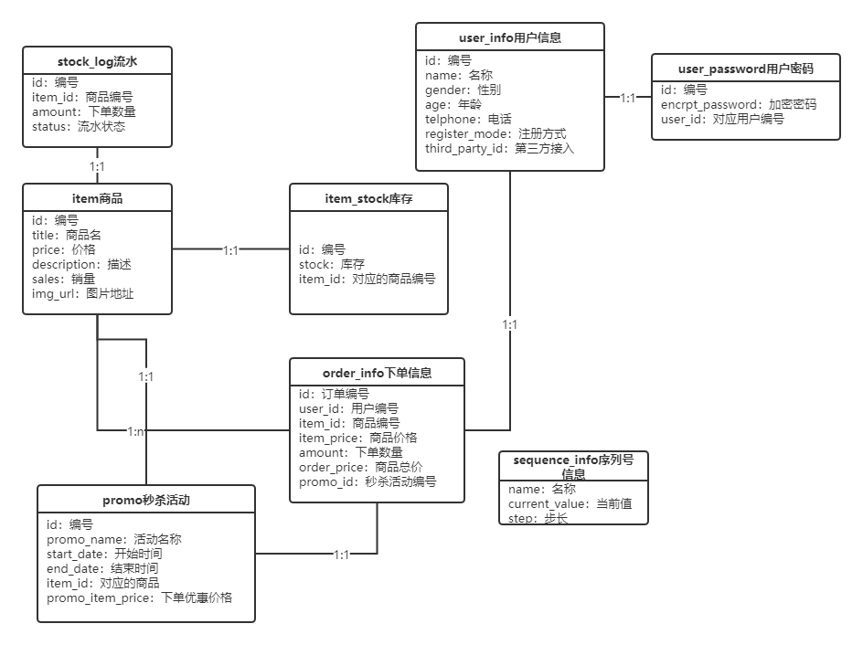
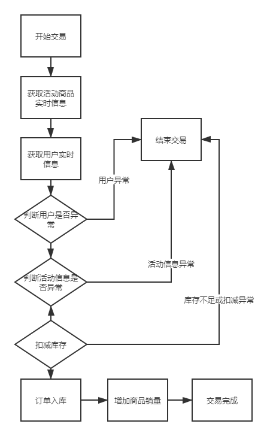
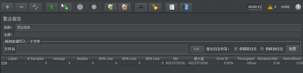
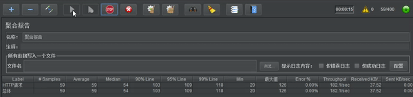
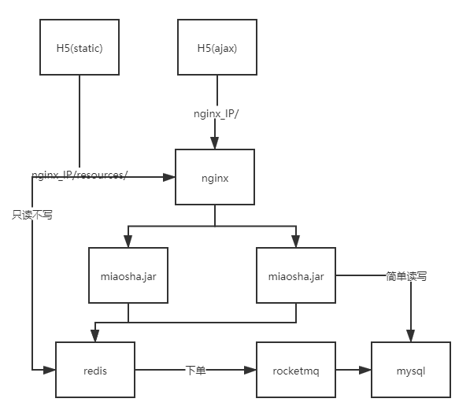
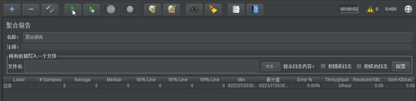
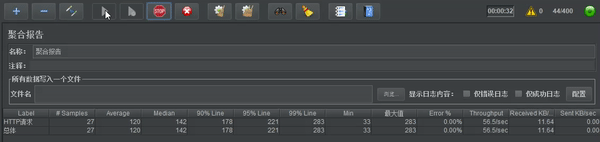

# 项目说明

该项目为自研《秒杀系统优化》项目，主要关注在性能优化方面：

- 技术栈：Spring Boot、rocketmq、Redis
- 优化点：
  - 硬件部署及配置优化
    - 云端部署
      - [tomcat容器参数优化](#tomcat容器参数优化)
      - [keepalive优化](#keepalive优化)
    - 分布式扩展
      - [水平扩展优化](#水平扩展优化)
      - [动静分离优化](#水平扩展优化)
      - [反向代理优化](#水平扩展优化)
      - 分布式会话优化
  - 过载保护优化
    - 流量削峰
      - [令牌分离优化](#令牌分离优化)
      - [闸门流量化](#闸门流量化)
      - [队列泄洪](#队列泄洪)
    - 防刷限流
      - [验证码优化](#验证码)
      - [令牌桶限流](#令牌桶限流)
  - 查询优化
    - [redis缓存优化](#redis缓存优化)
    - [本地缓存优化](#本地缓存化)
    - [lua缓存优化](#lua缓存优化)
  - 交易优化
    - [交易验证优化](#交易验证优化)
    - [缓存库存优化](#缓存库存优化)
    - [异步流程优化](#异步流程优化)
    - [事务消息优化](#事务消息优化)
    - [库存售罄优化](#库存售罄优化)

# 代码结构

- config：保存的是redis配置、tomcat的优化配置
- controller：控制器
- dao：mapper接口
- dataobject：do域对象
- error：错误管理对象
- mq：消息队列
- response：返回的封装对象
- serializer：序列化配置
- service：服务层
- util：验证码工具类
- valtdator：返回前端页面

# 数据库模型



# 未做任何优化前的TPS测试

- 服务器配置
  - 处理器、内存、网络：1 vCPU 2 GiB、1Mbps
  - 线程组数：
    - 线程数：500
    - 循环次数：20


从图中可以看到，在500个线程数单机`tps`只有`219.3/sec`的吞吐量（这个吞吐量还会更低），同时已经出现请求错误的现象。

# 硬件部署及配置优化

### tomcat容器参数优化

- 修改应用中的`application.properties`

```shell
# 等待队列长度
server.tomcat.accpet-count=1000
# 最大工作线程数
server.tomcat.max-threads=800
# 最小工作线程数
server.tomcat.min-spare-threads=100
```

- 线程组数
  - 线程数：500
  - 循环次数：20


通过修改了配置之后，终于把错误率消灭掉，但是程序的`tps`仍然很低，只有`161.9/sec`。

### keepalive优化

为了能够将每次循环的请求不是立刻断开，而是沿用原来的tcp连接，可以在jmeter的请求中，打开`KeepAlive`配置。同时要注意过长的时间连接，所以服务端需要设置连接的最大请求数和不响应后多少秒断开keepalive连接，相应的代码如下：

```java
//当Spring容器内没有TomcatEmbeddedServletContainerFactory这个bean时，会吧此bean加载进spring容器中
@Component
public class WebServerConfiguration implements WebServerFactoryCustomizer<ConfigurableWebServerFactory>
{
    @Override
    public void customize(ConfigurableWebServerFactory configurableWebServerFactory)     {
        //使用对应工厂类提供给我们的接口定制化我们的tomcat connector
        ((TomcatServletWebServerFactory)configurableWebServerFactory)
                .addConnectorCustomizers(new TomcatConnectorCustomizer() {
                    @Override
                    public void customize(Connector connector) {

                        Http11NioProtocol protocol = (Http11NioProtocol) connector.getProtocolHandler();
                        //定制化keepalivetimeout,设置30秒内没有请求则服务端自动断开keepalive链接
                        protocol.setKeepAliveTimeout(30000);
                        //当客户端发送超过10000个请求则自动断开keepalive链接
                        protocol.setMaxKeepAliveRequests(10000);

                    }
                });
    }
}
```

### 水平扩展优化


- 部署

  - 假设`nginx_IP`、`miao1_IP`、`miao2_IP`、`mysql_IP`代表不同的主机。
  
  - 并在`nginx_IP`、`miao1_IP`、`miao2_IP`创建`/var/www`的目录。
  
- 通过maven打包`miaosha.jar`，并上传到`miao1_IP`、`miao2_IP`的`/var/www/miaosha`目录中。
  
  - 同时修改外置`application.properties`对应的`msyql`连接为`mysql_IP`。
  
    ```shell
    # 修改数据连接
    spring.datasource.url=jdbc:mysql://***.***.***.***(mysql_IP):3306/miaosha?useUnicode=true&characterEncoding=UTF-8
    # 修改密码
    spring.datasource.password=****
    ```
  
  - 在`nginx_IP`安装`openresty`，同时将`html`的内容放到nginx的`html`目录下，并且解压`static.zip`，得到需要的静态文件资源，同时修改`conf/nginx.conf`文件，添加静态资源映射，这也是**动静分离优化**的操作的一种
  
    ```shell
    # http下配置要代理的服务器
    upstream backend_server{
       server ***.***.***.***(miao1_IP) weight=1;
       server ***.***.***.***(miao2_IP) weight=1;
       keepalive 30; #长链接时间
    }
    # server下静态资源配置
    location /resources/
    {
        alias /usr/local/openresty/nginx/html/resources/; #路径根据自己放的位置修改
        index  index.html index.htm;
    }
    
    # server下动态资源配置
    location / {
         # nginx处理的时候，会反向代理道对应的服务器上
         proxy_pass http://backend_server;
         #proxy_cache tmp_cache; # keys_zone 将这个作为这里的反向代理配置
         #proxy_cache_key $uri;
         #proxy_cache_valid 200 206 304 302 7d; #返回这些状态码的时候才缓存
         #proxy_set_header Host $http_host:$proxy_port;
         proxy_set_header Host $http_host;
         proxy_set_header X-Real-IP $remote_addr; #真正的地址是远端的地址，否则会拿到的是nginx的地址
         proxy_set_header X-Forwarded-For $proxy_add_x_forwarded_for; #nginx作为代理服务器，转发了请求
         proxy_http_version 1.1; #使用http1.1协议
         proxy_set_header Connection ""; #默认使用keepalive
    }
    ```
  
  - 同时在`miao1_IP`，`miao2_IP`的外置`application.properties`可开启访问日志
  
    ```shell
    #开启访问日志
    server.tomcat.accesslog.enabled=true 
    #日志存放的位置
    server.tomcat.accesslog.directory=/var/www/miaosha/tomcat 
    #日志记录的格式
    server.tomcat.accesslog.pattern=%h %l %u %t "%r" %s %b %D 
    ```
  
- 服务器配置

  - `nginx_IP`

    - 处理器、内存、网络：1 vCPU 1 GiB、5Mbps

  - `miao1_IP`、`miao2_IP`

    - 处理器、内存、网络：1 vCPU 1 GiB、5Mbps

  - `mysql_IP`

    - 处理器、内存、网络：1 vCPU 2 GiB 、1Mbps

  - 线程组

    - 线程数：800
    - 循环次数：20

    

从中可以看到，`tps`终于可以达道`845.4/sec`，但是最大得瓶颈还是在sql端，这个位置会很影响数据的传输。

# 查询优化

### redis缓存优化


- 第一个优化方案，首先将商品信息，提到redis库中，尽量靠近上游。

  ```java
      @RequestMapping(value = "/get",method = {RequestMethod.GET})
      @ResponseBody
      public CommonReturnType getItem(@RequestParam(name = "id")Integer id)
      {
          // 先查询有没有对应商品的缓存
          ItemModel itemModel = (ItemModel) redisTemplate.opsForValue().get("item_"+id);
  
          // 没有就查询数据库
          if(itemModel == null){
              itemModel = itemService.getItemById(id);
              //设置 缓存置入 到redis内
              redisTemplate.opsForValue().set("item_"+id,itemModel);
              redisTemplate.expire("item_"+id,10, TimeUnit.MINUTES);
          }
  
          ItemVO itemVO = convertVOFromModel(itemModel);
  
          return CommonReturnType.create(itemVO);
  
      }
  ```

- 线程组：

  - 线程数：800

  - 循环次数：20

    

加了redis缓存，但是效果还是部室特别明显，可能和网络关系等仍然有关，这次的优化的`tps`只有`835.6/sec`，相对于水平扩展，倒是没有错误率了，同时这里开始数据**不会保持一致性**了。

### 本地缓存化

- 第二个优化方案是使用guava进行本地缓存，将缓存提到jvm中，形成多级缓存。

  ```java
      //商品详情页浏览
      @RequestMapping(value = "/get",method = {RequestMethod.GET})
      @ResponseBody
      public CommonReturnType getItem(@RequestParam(name = "id")Integer id){
          ItemModel itemModel = null;
  
          //先取本地缓存
          itemModel = (ItemModel) cacheService.getFromCommonCache("item_"+id);
  
          if(itemModel == null){
              //根据商品的id到redis内获取
              itemModel = (ItemModel) redisTemplate.opsForValue().get("item_"+id);
  
              //若redis内不存在对应的itemModel,则访问下游service
              if(itemModel == null){
                  itemModel = itemService.getItemById(id);
                  //设置itemModel到redis内
                  redisTemplate.opsForValue().set("item_"+id,itemModel);
                  redisTemplate.expire("item_"+id,10, TimeUnit.MINUTES);
              }
              //填充本地缓存
              cacheService.setCommonCache("item_"+id,itemModel);
          }
  
          ItemVO itemVO = convertVOFromModel(itemModel);
          return CommonReturnType.create(itemVO);
      }
  ```

- 线程组：

  - 线程数：800
  - 循环次数：20

  

这次优化相对而言，又有一定得性能提升了，还是jvm本地缓存比较直接，`tps`达到了`851.4/sec`。

### lua缓存优化


- 首先在`/usr/local/openresty/lua`的目录下编写`itemredis.lua`脚本，其实就是让nginx直接从redis获取结果，返回给前端

  ```shell
  # 首先从请求的link上获取参数
  local args = ngx.req.get_uri_args()
  # 获取对应的id参数
  local id = args["id"]
  # 引入redis的模块
  local redis = require "resty.redis"
  # 新建缓存
  local cache = redis:new()
  # 连接redis
  local ok,err = cache:connect("***.***.***.***",6379)
  # 如果有对应的缓存
  local item_model = cache:get("item_"..id)
  # 如果不存在，就请求
  if item_model == ngx.null or item_model == nil then
          # 缓存对应的对象
          local resp = ngx.location.capture("/item/get?id="..id) 
          # 得到相应
          item_model = resp.body
  end
  # 返回对应的缓存结果
  ngx.say(item_model)
  ```

- 配置`nginx.conf`

  ```shell
  location /luaitem/get{
      default_type "application/json";
      #需要在redis中添加这一行
      content_by_lua_file ../lua/itemredis.lua;
  }
  ```

- 线程组：

  - 线程数：800

  - 循环次数：20

    

果然，越靠近用户的上游，越容易达到一个好的峰值。这次的优化的`tps`简单冲破`959.8/sec`，这比路由过去服务器来得更加及时。

# 交易优化

上面主要关注的是读的性能优化，这其实做了缓存之后，数据不会及时的与数据库同步。这时候的数据其实是伪数据，但是没关系，我觉得只要交易的情况下，不要出现超卖的现象，这些伪数据不会对现实有多大影响。再交易前，先测试未优化的代码：



```java
    @Override
    @Transactional
    public OrderModel createOrder(Integer userId, Integer itemId, Integer promoId, Integer amount) throws BusinessException {

        //1.校验下单状态,下单的商品是否存在，用户是否合法，购买数量是否正确
        ItemModel itemModel = itemService.getItemById(itemId);
        if(itemModel == null){
            throw new BusinessException(EmBusinessError.PARAMETER_VALIDATION_ERROR,"商品信息不存在");
        }

        // 获取用户信息，检查用户是不是根本不存在
        UserModel userModel = userService.getUserById(userId);
        if(userModel == null){
            throw new BusinessException(EmBusinessError.PARAMETER_VALIDATION_ERROR,"用户信息不存在");
        }
        if(amount <= 0 || amount > 99){
            throw new BusinessException(EmBusinessError.PARAMETER_VALIDATION_ERROR,"数量信息不正确");
        }

        // 校验秒杀活动信息是否存在
        if(promoId != null){
            //（1）校验对应活动是否存在这个适用商品
            if(promoId.intValue() != itemModel.getPromoModel().getId()){
                throw new BusinessException(EmBusinessError.PARAMETER_VALIDATION_ERROR,"活动信息不正确");
                //（2）校验活动是否正在进行中
            }else if(itemModel.getPromoModel().getStatus().intValue() != 2) {
                throw new BusinessException(EmBusinessError.PARAMETER_VALIDATION_ERROR,"活动信息还未开始");
            }
        }

        // 2.落单减库存
        boolean result = itemService.decreaseStock(itemId,amount);
        if(!result){
            throw new BusinessException(EmBusinessError.STOCK_NOT_ENOUGH);
        }

        // 3.订单入库
        OrderModel orderModel = new OrderModel();
        orderModel.setUserId(userId);
        orderModel.setItemId(itemId);
        orderModel.setAmount(amount);
        if(promoId != null){
            orderModel.setItemPrice(itemModel.getPromoModel().getPromoItemPrice());
        }else{
            orderModel.setItemPrice(itemModel.getPrice());
        }
        orderModel.setPromoId(promoId);
        orderModel.setOrderPrice(orderModel.getItemPrice().multiply(new BigDecimal(amount)));

        // 4.生成交易流水号,订单号
        orderModel.setId(generateOrderNo());
        OrderDO orderDO = convertFromOrderModel(orderModel);
        orderDOMapper.insertSelective(orderDO);

        // 5.加上商品的销量
        itemService.increaseSales(itemId,amount);
        // 6.返回前端
        return orderModel;
    }
```

- 线程组

  - 线程数：400

  - 循环次数：20

    

从结果上看，没优化之前，写入的效率还是停高的，`tps`居然能达到`699.1/sec`，可能还是云服务器的硬盘还是比较强的吧，否则为什么`4-5`次的sql查询并发这么高。。

### 交易验证优化

最简单的想法，在验证数据有`2`个都可以用redis进行优化，例如验证商品信息，还有用户信息，其实都可以放到redis中存入进去，然后验证的话，就不需要重复的从redis取数据了。

```java
    @Override
    @Transactional
    public OrderModel createOrder(Integer userId, Integer itemId, Integer promoId, Integer amount) throws BusinessException {

        //1.校验下单状态,下单的商品是否存在，用户是否合法，购买数量是否正确
        ItemModel itemModel = itemService.getItemByIdInCache(itemId);
		...

        // 获取用户信息，检查用户是不是根本不存在
        UserModel userModel = userService.getUserByIdInCache(userId);
		...
    }

    // 缓存商品信息
    @Override
    public ItemModel getItemByIdInCache(Integer id) {
        ItemModel itemModel = (ItemModel) redisTemplate.opsForValue().get("item_validate_"+id);
        if(itemModel == null){
            itemModel = this.getItemById(id);
            redisTemplate.opsForValue().set("item_validate_"+id,itemModel);
            redisTemplate.expire("item_validate_"+id,10, TimeUnit.MINUTES);
        }
        return itemModel;
    }

    // 用户信息缓存
    @Override
    public UserModel getUserByIdInCache(Integer id) {
        UserModel userModel = (UserModel) redisTemplate.opsForValue().get("user_validate_"+id);
        if(userModel == null){
            userModel = this.getUserById(id);
            redisTemplate.opsForValue().set("user_validate_"+id,userModel);
            redisTemplate.expire("user_validate_"+id,10, TimeUnit.MINUTES);
        }
        return userModel;
    }
```

- 线程组

  - 线程数：400

  - 循环次数：20

    

`tps`为`612.1/sec`，为什么性能怎么还下降了呢？感觉优化了个寂寞，其实理论上，应该性能是提升了，测试有点不到准。

### 缓存库存优化

优化还是需要落到库中，所以我们在扣取库存之前，我们要对减库进行优化成行锁：

```java
<update id="decreaseStock">
  update item_stock
  set stock = stock - #{amount}
  where item_id = #{itemId} and stock >= #{amount}
</update>
  
alter table item_stock add unique index item_id_index(item_id)  
```

其实，扣减库存之前再想想，是不是一定得从数据库中减呢？其实活动开始之前，我们可以把数据，先提到redis当中，然后直接往redis扣减，而且redis是单线程的，根本不会出现多扣的情况，所以效率非常高，然后异步的把数据提到mysql当中。

```java
    // 在PromoServiceImpl实现
    @Override
    public void publishPromo(Integer promoId) {
        // 通过活动id获取活动
        PromoDO promoDO = promoDOMapper.selectByPrimaryKey(promoId);
        if(promoDO.getItemId() == null || promoDO.getItemId().intValue() == 0){
            return;
        }
        // 同时获取获取对应活动商品的id，得到库存
        ItemModel itemModel = itemService.getItemById(promoDO.getItemId());

        // 将库存同步到redis内
        redisTemplate.opsForValue().set("promo_item_stock_"+itemModel.getId(), itemModel.getStock());
    }

// 在controller中提供一个接口，把redis数据挂上 
@RequestMapping(value = "/publishpromo",method = {RequestMethod.GET})
@ResponseBody
public CommonReturnType publishpromo(@RequestParam(name = "id")Integer id){
    promoService.publishPromo(id);
    return CommonReturnType.create(null);
}

    @Override
    @Transactional
    public boolean decreaseStock(Integer itemId, Integer amount) throws BusinessException {
        // 从redis中，扣取库存
        long result = redisTemplate.opsForValue().increment("promo_item_stock_"+itemId,amount.intValue() * -1);
        if(result >0){
            //更新库存成功
            return true;
        }else{
            return false;
        }

    }
```

这时候没有到库中，我们已经把库的代码删除掉了，所以还要异步库存接入。

### 异步流程优化



使用异步化，就可以用消息队列，rocketmq就不说怎么安装了，最麻烦的是rocketmq，所以这里写入单机外部配置，否则没办法连上rocketmq：

```shell
# /var/www/rocketmq/rocketmq-all-4.5.0-bin-release

# vim conf/broker.conf
brokerClusterName = DefaultCluster
brokerName = broker-a
brokerId = 0
deleteWhen = 04
fileReservedTime = 48
brokerRole = ASYNC_MASTER
flushDiskType = ASYNC_FLUSH
namesrvAddr = ***.***.***.***(外网ip):9876
brokerIP1 = ***.***.***.***(外网ip)

# 打开对应的namesrv
nohup ./bin/mqnamesrv -n ***.***.***.***(外网ip):9876 &
# 打开对应的broker，这样才能获取到对应外网连接
nohup sh bin/mqbroker -n ***.***.***.***(外网ip):9876 autoCreateTopicEnable=true -c ./conf/broker.conf &
# 同时记得在lib包里面，上传一个sunjce_provider.jar包，这样才能使用对应加密技术
```

同时提供两个测试程序，测试mq是否联通

- 消费者

  ```java
  public class Consumer {
  
      public static void main(String[] args) throws InterruptedException, MQClientException {
  
          //声明并初始化一个consumer
          //需要一个consumer group名字作为构造方法的参数，这里为consumer1
          DefaultMQPushConsumer consumer = new DefaultMQPushConsumer("consumer1");
          //consumer.setVipChannelEnabled(false);
          //同样也要设置NameServer地址
          consumer.setNamesrvAddr("***.***.***.***(namesrvIP):9876");
  
          //这里设置的是一个consumer的消费策略
          //CONSUME_FROM_LAST_OFFSET 默认策略，从该队列最尾开始消费，即跳过历史消息
          //CONSUME_FROM_FIRST_OFFSET 从队列最开始开始消费，即历史消息（还储存在broker的）全部消费一遍
          //CONSUME_FROM_TIMESTAMP 从某个时间点开始消费，和setConsumeTimestamp()配合使用，默认是半个小时以前
          consumer.setConsumeFromWhere(ConsumeFromWhere.CONSUME_FROM_FIRST_OFFSET);
  
          //设置consumer所订阅的Topic和Tag，*代表全部的Tag
          consumer.subscribe("hello", "*");
  
          //设置一个Listener，主要进行消息的逻辑处理
          consumer.registerMessageListener(new MessageListenerConcurrently() {
  
              @Override
              public ConsumeConcurrentlyStatus consumeMessage(List<MessageExt> msgs,
                                                              ConsumeConcurrentlyContext context) {
  
                  System.out.println(Thread.currentThread().getName() + " Receive New Messages: " + msgs);
                  System.out.println("----------------------------------------------------------------------------------");
                  //返回消费状态
                  //CONSUME_SUCCESS 消费成功
                  //RECONSUME_LATER 消费失败，需要稍后重新消费
                  return ConsumeConcurrentlyStatus.CONSUME_SUCCESS;
              }
          });
          //调用start()方法启动consumer
          consumer.start();
          System.out.println("Consumer Started.");
      }
  }
  ```

- 生产者

  ```java
  public class Producer {
      public static void main(String[] args) throws MQClientException, InterruptedException {
  
          // 声明并初始化一个producer
          // 需要一个producer group名字作为构造方法的参数，这里为producer1
          DefaultMQProducer producer = new DefaultMQProducer("producer1");
          producer.setVipChannelEnabled(false);
          // 设置NameServer地址,此处应改为实际NameServer地址，多个地址之间用；分隔
          // NameServer的地址必须有
          // producer.setClientIP("119.23.211.22");
          // producer.setInstanceName("Producer");
          producer.setSendMsgTimeout(6000);
          producer.setNamesrvAddr("***.***.***.***(namesrvIP):9876");
  
          // 调用start()方法启动一个producer实例
          producer.start();
  
          // 发送1条消息到Topic为TopicTest，tag为TagA，消息内容为“Hello RocketMQ”拼接上i的值
          try {
              // 封装消息
              Message msg = new Message("hello",// topic
                      "TagA",// tag
                      ("Hello RocketMQ").getBytes(RemotingHelper.DEFAULT_CHARSET)// body
              );
              // 调用producer的send()方法发送消息
              // 这里调用的是同步的方式，所以会有返回结果
              SendResult sendResult = producer.send(msg);
              // 打印返回结果
              System.out.println(sendResult);
          } catch (RemotingException e) {
              e.printStackTrace();
          } catch (MQBrokerException e) {
              e.printStackTrace();
          } catch (UnsupportedEncodingException e) {
              e.printStackTrace();
          }
          //发送完消息之后，调用shutdown()方法关闭producer
          System.out.println("send success");
          producer.shutdown();
      }
  }
  ```

其实，这里的写入业务，其实还有问题的，基本上都是直接打到数据库上，数据库挂不挂可能得看缘分了，所以这里可以做一个操作，就是秒杀开始之前，先把库存挂起，存到redis当中：

```java
// 把商品的库存，放到redis中
@RequestMapping(value = "/publishpromo",method = {RequestMethod.GET})
@ResponseBody
public CommonReturnType publishpromo(@RequestParam(name = "id")Integer id){
    promoService.publishPromo(id);
    return CommonReturnType.create(null);
}
```

然后修改减库存的逻辑，就是减少库存的时候，直接对redis里的库存减少1，成功之后，可以把消息放入到mq中，等待mq处理：

```java
    @Override
    @Transactional
    public boolean decreaseStock(Integer itemId, Integer amount) throws BusinessException {
        // 1. 首先对库存减1
        long result = redisTemplate.opsForValue().increment("promo_item_stock_"+itemId,amount.intValue() * -1);
        if(result >0){
            // 2.redis更新库存成功，利用mq发送消息
            boolean mqResult = mqProducer.asyncReduceStock(itemId,amount);
            if(!mqResult)
            {  // 不成功的话，肯定回退啊
			                redisTemplate.opsForValue().increment("promo_item_stock_"+itemId,amount.intValue());
                return false;
            }
            return true;
        }else{
            //更新库存失败
            redisTemplate.opsForValue().increment("promo_item_stock_"+itemId,amount.intValue());
            return false;
        }
    }
```

- 队列生产者

  ```java
  @Component
  public class MqProducer {
  
      private DefaultMQProducer producer;
  
      private TransactionMQProducer transactionMQProducer;
  
      @Value("${mq.nameserver.addr}")
      private String nameAddr;
  
      @Value("${mq.topicname}")
      private String topicName;
  
      @Autowired
      private OrderService orderService;
  
      @PostConstruct
      public void init() throws MQClientException {
          //做mq producer的初始化
          producer = new DefaultMQProducer("producer_group");
          producer.setNamesrvAddr(nameAddr);
          producer.setSendMsgTimeout(6000);
          producer.start();
      }
  
      // 同步库存扣减消息
      public boolean asyncReduceStock(Integer itemId,Integer amount)
      {
          // 创建消息
          Map<String,Object> bodyMap = new HashMap<>();
          bodyMap.put("itemId",itemId);
          bodyMap.put("amount",amount);
          Message message = new Message(topicName,"increase",
                  JSON.toJSON(bodyMap).toString().getBytes(Charset.forName("UTF-8")));
  
          // 发送
          producer.send(message);
  		...
          return true;
      }
  }
  ```

- 队列消费者

  ```java
  @Component
  public class MqConsumer {
  
      private DefaultMQPushConsumer consumer;
      @Value("${mq.nameserver.addr}")
      private String nameAddr;
  
      @Value("${mq.topicname}")
      private String topicName;
      
      @Autowired
      private ItemStockDOMapper itemStockDOMapper;
  
      @PostConstruct
      public void init() throws MQClientException {
          consumer = new DefaultMQPushConsumer("stock_consumer_group");
          consumer.setNamesrvAddr(nameAddr);
          consumer.subscribe(topicName,"*");
  
          consumer.registerMessageListener(new MessageListenerConcurrently() {
              @Override
              public ConsumeConcurrentlyStatus consumeMessage(List<MessageExt> msgs, ConsumeConcurrentlyContext context) {
                  // 实现库存真正到数据库内扣减的逻辑
                  Message msg = msgs.get(0);
                  String jsonString  = new String(msg.getBody());
                  Map<String,Object>map = JSON.parseObject(jsonString, Map.class);
                  Integer itemId = (Integer) map.get("itemId");
                  Integer amount = (Integer) map.get("amount");
                  // 真正减库存
                  itemStockDOMapper.decreaseStock(itemId,amount);
                   return ConsumeConcurrentlyStatus.CONSUME_SUCCESS;
              }
          });
  
          consumer.start();
      }
  }
  ```

- 线程组

  - 线程数：400

  - 循环次数：20

    


这次的`tps`有点人间迷惑，性能变成`254.2/sec`了，感觉mq这个地方的配置估计仍然要修复一下，但是理想的状态之下，应该是有相应的性能提升，`average`的响应时间也都很高。

### 事务消息优化

暂时先忽略这个问题吧，但是目前是有些很致命的问题，假如在流水当中，如果某个原因导致事务回滚了，可是，我们的mq请求也提交了，这就出现超卖的现象，我们允许少卖，但是超卖还是杜绝发生这个问题的，所以需要对消息进行事务型处理。

```java
// 创建订单    
@RequestMapping(value = "/createorder",method = {RequestMethod.POST},consumes={CONTENT_TYPE_FORMED})
    @ResponseBody
    public CommonReturnType createOrder(@RequestParam(name="itemId")Integer itemId,
                                        @RequestParam(name="amount")Integer amount,
                                        @RequestParam(name="promoId",required = false)Integer promoId) throws BusinessException {

        // 这次我们在下订单的时候，直接放到mq的事务当中
  if(!mqProducer.transactionAsyncReduceStock(userModel.getId(),itemId,promoId,amount,stockLogId)){
            throw new BusinessException(EmBusinessError.UNKNOWN_ERROR,"下单失败");
        }
        return CommonReturnType.create(null);
    }
```

首先装配事务型mq：

```java
        transactionMQProducer = new TransactionMQProducer("transaction_producer_group");
        transactionMQProducer.setNamesrvAddr(nameAddr);
        transactionMQProducer.start();
        // 这种方式，就是大名鼎鼎的2PC
        transactionMQProducer.setTransactionListener(new TransactionListener() {
            @Override
            public LocalTransactionState executeLocalTransaction(Message msg, Object arg) {
                //真正要做的事  创建订单
                Integer itemId = (Integer) ((Map)arg).get("itemId");
                Integer promoId = (Integer) ((Map)arg).get("promoId");
                Integer userId = (Integer) ((Map)arg).get("userId");
                Integer amount = (Integer) ((Map)arg).get("amount");
                try {
                    // 在这个地方提交订单！！
                   orderService.createOrder(userId,itemId,promoId,amount,stockLogId);
                } catch (BusinessException e) {
                    e.printStackTrace(); // 如果失败，我们的消息，就可以回滚了
                    return LocalTransactionState.ROLLBACK_MESSAGE;
                }
                return LocalTransactionState.COMMIT_MESSAGE;
            }

            @Override
            public LocalTransactionState checkLocalTransaction(MessageExt msg) {
				...
            }
        });
```

所以，我们先把消息可以先发送到mq队列中，然后等待`transactionMQProducer`来异步的执行回调的`OrderServiceImpl.createOrder`：

```java
    //事务型同步库存扣减消息
    public boolean transactionAsyncReduceStock(Integer userId,Integer itemId,Integer promoId,Integer amount){
        // 这时消息信息
        Map<String,Object> bodyMap = new HashMap<>();
        bodyMap.put("itemId",itemId);
        bodyMap.put("amount",amount);
        
        // 带上执行的参数信息
        Map<String,Object> argsMap = new HashMap<>();
        argsMap.put("itemId",itemId);
        argsMap.put("amount",amount);
        argsMap.put("userId",userId);
        argsMap.put("promoId",promoId);

        Message message = new Message(topicName,"increase",
                JSON.toJSON(bodyMap).toString().getBytes(Charset.forName("UTF-8")));
        TransactionSendResult sendResult = null;
			// 发送信息
            sendResult = transactionMQProducer.sendMessageInTransaction(message,argsMap);

    }
```

在`OrderServiceImpl.createOrder`中，我们就可以把mq消息提交给取消掉了，因为消息已经提交，只是等待`createOrder`事务的执行，但是这里其实仍然有个致命的问题，假如虽然`OrderServiceImpl.createOrder`执行成功了，但是突然断电，`producer`没来得及发送对`COMMIT_MESSAGE`，那么mq肯定会不断的回查信息，执行`checkLocalTransaction`方法。但是我们也不知道如何判断上次执行是否成功，因为根本没办法查到对应的流水状态，就不知道该返回什么信息给mq。所以，我们需要想一个办法，去处理`OrderServiceImpl.createOrder`中的一个执行过程的流水供状态查阅。

首先创建`StockLogDO`，用于记录每一笔订单状态：

```java
public class StockLogDO {
    // 通过uuid生成key
    private String stockLogId;

    private Integer itemId;

    private Integer amount;
    // 1：代表初始化，2：代表已完成，3：代表已回滚
    private Integer status;
}
```

所以在`OrderController.createOrder`中，执行异步消息之前，我们先初始化对应的`StockLogDO`：

```java
    public CommonReturnType createOrder(@RequestParam(name="itemId")Integer itemId,
                                        @RequestParam(name="amount")Integer amount,
                                        @RequestParam(name="promoId",required = false)Integer promoId) throws BusinessException {

        ...
        // 先初始化StockLog为1
        String stockLogId = itemService.initStockLog(itemId,amount);

        //再去完成对应的下单事务型消息机制
    if(!mqProducer.transactionAsyncReduceStock(userModel.getId(),itemId,promoId,amount,stockLogId)){
            throw new BusinessException(EmBusinessError.UNKNOWN_ERROR,"下单失败");
        }
        return CommonReturnType.create(null);
    }
```

得到了对应`stockLogId`，我们也要传到`producer`中，所以参数中，还要带上这个参数，因为是为了记录`OrderServiceImpl.createOrder`中状态：

```java
    public OrderModel createOrder(Integer userId, Integer itemId, Integer promoId, Integer amount,String stockLogId) throws BusinessException {
        // 1.校验下单状态,下单的商品是否存在，用户是否合法，购买数量是否正确
        ...

        // 2.校验活动信息
        ...

        // 3.落单减库存
        ...

        // 4.订单入库，生成交易流水号,订单号
        ...
            
        // 5.加上商品的销量
        ..

        // 6.设置库存流水状态为成功 ！！！
        StockLogDO stockLogDO = stockLogDOMapper.selectByPrimaryKey(stockLogId);
        if(stockLogDO == null){
            throw new BusinessException(EmBusinessError.UNKNOWN_ERROR);
        }
        stockLogDO.setStatus(2); // 执行到这里已经算正常了
        stockLogDOMapper.updateByPrimaryKeySelective(stockLogDO);

        // 7.返回前端
        ...
    }
```

所以在`producer`事务中，如果成功了，肯定返回`COMMIT_MESSAGE`，否则我们还要标记第3个状态：

```java
            public LocalTransactionState executeLocalTransaction(Message msg, Object arg) {
                //真正要做的事  创建订单
                ...
                try {
                    orderService.createOrder(userId,itemId,promoId,amount,stockLogId);
                } catch (BusinessException e) {
                    e.printStackTrace();
                    //设置对应的stockLog为回滚状态
                    StockLogDO stockLogDO = stockLogDOMapper.selectByPrimaryKey(stockLogId);
                    stockLogDO.setStatus(3); //出异常了，一定得标记
                    stockLogDOMapper.updateByPrimaryKeySelective(stockLogDO);
                    return LocalTransactionState.ROLLBACK_MESSAGE;
                }
                return LocalTransactionState.COMMIT_MESSAGE;
            }
```

如果中途发生断电之类得问题，我们在mq回查机制得时候，完全可以通过`StockLog`来查看流水：

```java
            @Override
            public LocalTransactionState checkLocalTransaction(MessageExt msg) {
                //根据是否扣减库存成功，来判断要返回COMMIT,ROLLBACK还是继续UNKNOWN
                String jsonString  = new String(msg.getBody());
                Map<String,Object>map = JSON.parseObject(jsonString, Map.class);
                Integer itemId = (Integer) map.get("itemId");
                Integer amount = (Integer) map.get("amount");
                String stockLogId = (String) map.get("stockLogId");
                StockLogDO stockLogDO = stockLogDOMapper.selectByPrimaryKey(stockLogId);
                if(stockLogDO == null){
                    return LocalTransactionState.UNKNOW;
                }
                // 如果正常了，肯定提交啊
                if(stockLogDO.getStatus().intValue() == 2){
                    return LocalTransactionState.COMMIT_MESSAGE;
                    // 不知道什么情况，继续等
                }else if(stockLogDO.getStatus().intValue() == 1){
                    return LocalTransactionState.UNKNOW;
                }
                // 回滚
                return LocalTransactionState.ROLLBACK_MESSAGE;
            }
```

但是，这里其实还有问题的，假如redis成功，但是事务出现异常，这是回滚不了的，所以这里还有一些问题，起码不会出现超卖现象，这个还有待处理。

- 线程组

  - 线程数：400

  - 循环次数：20

    

这次的优化相对上次的`tps`还要在低一些，只达到`213.0/sec`，性能有一些下降是正常，因为多了sql的查询，业务上的安全性增加了，所以不意外，但是我还是很纠结mq的效率，这也太低了吧，断崖式下降。

### 库存售罄优化

其实我们加入流水的检查之后，每次都会创建一个新的`StockLog`，加入库存已经`0`了，可是我们还一直创建`StockLog`，这也是非常影响的，所以我们可以在redis上做标记：

```java
    public boolean decreaseStock(Integer itemId, Integer amount) throws BusinessException {
        //int affectedRow =  itemStockDOMapper.decreaseStock(itemId,amount);
        long result = redisTemplate.opsForValue().increment("promo_item_stock_"+itemId,amount.intValue() * -1);
        if(result >0){
            //更新库存成功
            return true;
        }else if(result == 0){
            //打上库存已售罄的标识
            redisTemplate.opsForValue().set("promo_item_stock_invalid_"+itemId,"true");

            //更新库存成功
            return true;
        }else{
            //更新库存失败
            increaseStock(itemId,amount);
            return false;
        }
    }
```

所以每当创建之前，我们都可以先从redis检查对应的标记，以避免对应的创建`StockLog`。

# 过载保护优化

### 令牌分离优化

在上面流程中，我们的一些验证，每次都在`OrderServiceImpl.createOrder`时候创建，这样一来，一定程序上造成这个接口的冗余，同时为了能够削掉峰值，只允许有令牌的人购买商品，所以提出这种方案。

首先先创建对应的生成令牌的函数，这时候可以把验证提到令牌生成中：

```java
    @Override
    public String generateSecondKillToken(Integer promoId,Integer itemId,Integer userId) {

        PromoDO promoDO = promoDOMapper.selectByPrimaryKey(promoId);

        PromoModel promoModel = convertFromDataObject(promoDO);
        if(promoModel == null){
            return null;
        }

        // 判断item信息是否存在
        ItemModel itemModel = itemService.getItemByIdInCache(itemId);
        if(itemModel == null){
            return null;
        }
        // 判断用户信息是否存在
        UserModel userModel = userService.getUserByIdInCache(userId);
        if(userModel == null){
            return null;
        }

        // 判断当前时间是否秒杀活动即将开始或正在进行
        if(promoModel.getStartDate().isAfterNow()){
            promoModel.setStatus(1);
        }else if(promoModel.getEndDate().isBeforeNow()){
            promoModel.setStatus(3);
        }else{
            promoModel.setStatus(2);
        }

        // 判断活动是否正在进行
        if(promoModel.getStatus().intValue() != 2){
            return null;
        }

        // 生成token并且存入redis内并给一个5分钟的有效期
        String token = UUID.randomUUID().toString().replace("-","");
        // 包含了用户信息的token
        redisTemplate.opsForValue().set("promo_token_"+promoId+"_userid_"+userId+"_itemid_"+itemId,token);
        redisTemplate.expire("promo_token_"+promoId+"_userid_"+userId+"_itemid_"+itemId,5, TimeUnit.MINUTES);

        return token;
    }
```

同时在`controller`层提供接口，将令牌生成先给客户端：

```java
    //生成秒杀令牌
    @RequestMapping(value = "/generatetoken",method = {RequestMethod.POST},consumes={CONTENT_TYPE_FORMED})
    @ResponseBody
    public CommonReturnType generatetoken(@RequestParam(name="itemId")Integer itemId,
                                          @RequestParam(name="promoId")Integer promoId) throws BusinessException {
        // 根据token获取用户信息
        String token = httpServletRequest.getParameterMap().get("token")[0];
        if(StringUtils.isEmpty(token)){
            throw new BusinessException(EmBusinessError.USER_NOT_LOGIN,"用户还未登陆，不能下单");
        }

        //获取用户的登陆信息
        UserModel userModel = (UserModel) redisTemplate.opsForValue().get(token);
        if(userModel == null){
            throw new BusinessException(EmBusinessError.USER_NOT_LOGIN,"用户还未登陆，不能下单");
        }

        // 获取秒杀访问令牌
        String promoToken = promoService.generateSecondKillToken(promoId,itemId,userModel.getId());

        if(promoToken == null){
            throw new BusinessException(EmBusinessError.PARAMETER_VALIDATION_ERROR,"生成令牌失败");
        }
        //返回对应的结果
        return CommonReturnType.create(promoToken);
    }
```

接着，我们在`OrderController.createOrder`之前，把验证令牌：

```java
    public CommonReturnType createOrder(@RequestParam(name="itemId")Integer itemId,
                                        @RequestParam(name="amount")Integer amount,
                                        @RequestParam(name="promoId",required = false)Integer promoId,
                                        @RequestParam(name="promoToken",required = false)String promoToken) throws BusinessException {
         ...

        //校验秒杀令牌是否正确
        if(promoId != null){
            String inRedisPromoToken = (String) redisTemplate.opsForValue().get("promo_token_"+promoId+"_userid_"+userModel.getId()+"_itemid_"+itemId);  
            // 先检查redis是否存在令牌
            if(inRedisPromoToken == null){
                throw new BusinessException(EmBusinessError.PARAMETER_VALIDATION_ERROR,"秒杀令牌校验失败");
            }
            // 接着和redis的令牌对比          
             if(!org.apache.commons.lang3.StringUtils.equals(promoToken,inRedisPromoToken)){
                throw new BusinessException(EmBusinessError.PARAMETER_VALIDATION_ERROR,"秒杀令牌校验失败");
            }
        }

        ...
    }
```

这样，`OrderServiceImpl.createOrder`的时候，我们就可以把用户信息的检验，和活动的检验提前到生成令牌中，让`OrderServiceImpl.createOrder`更加简洁。但是其实个人感觉，接口多了，其实活动的验证，其实也增多了，只不过从业务逻辑上来讲，把这些无关业务提前，不失为一种好办法，同时令牌又可以提供灵活性，因为可以把风阔策略，和售罄前置到令牌发放时。

### 闸门流量化

但是其实这里也有个问题，秒杀令牌在活动开始的时候，就会无限制的生成，非常影响系统的性能。所以需要控制办法令牌的数量，控制大闸流量。

首先，我们在活动发布之前，就设定最大的发放令牌个数，这里设置为活动存储的5倍：

```java
    @Override
    public void publishPromo(Integer promoId) {

         ...
        //将大闸的限制数字设到redis内
        redisTemplate.opsForValue().set("promo_door_count_"+promoId,itemModel.getStock().intValue() * 5);

    }
```

然后在扣生成令牌的时候，我们来减去最大的发放令牌个数，同时真的还可以把验证库存是否售罄提前到这个位置上来：

```java
    @Override
    public String generateSecondKillToken(Integer promoId,Integer itemId,Integer userId) {

        // 判断是否库存已售罄，若对应的售罄key存在，则直接返回下单失败
        if(redisTemplate.hasKey("promo_item_stock_invalid_"+itemId)){
            return null;
        }
        ...

        // 获取秒杀大闸的count数量
        long result = redisTemplate.opsForValue().increment("promo_door_count_"+promoId,-1);
        if(result < 0){
            return null;
        }
        ...
    }
```

这时削掉峰值的很直接的方法，但是也还是抵挡不住很大的流量，因为没办法抵住刷票的现象，还是有可能冲破局限。

### 队列泄洪

就是用排队的策略，来处理每个事务。也就是所有用户进入`OrderController.createOrder`后，我们不一定所有任务都开让线程直接执行，因为这步设置到事务操作，我们是否可以让所有任务排队？然后再执行对应的下单操作，队列一定程序比多线程要好，因为多线程太多线程切换，会导致很慢。实现的关键，可以创建线程池来执行：

```java
    @PostConstruct
    public void init()
    {
        executorService = Executors.newFixedThreadPool(20);
        ...
    }

    // 封装下单请求
    @RequestMapping(value = "/createorder",method = {RequestMethod.POST},consumes = {CONTENT_TYPE_FORMED})
    @ResponseBody
    public CommonReturnType createOrder(@RequestParam(name = "itemId") Integer itemId,
                                        @RequestParam(name = "amount") Integer amount,
                                        @RequestParam(name = "promoId",required = false) Integer promoId,
                                        @RequestParam(name = "promoToken",required = false) String promoToken
                                                ) throws BusinessException {

        ...
        // 同步调用线程池的submit方法
        // 拥塞窗口位20的等待队列，用来队列化泄洪
        Future<Object> future = executorService.submit(new Callable<Object>() {

            @Override
            public Object call() throws Exception
            {
                // 加入库存流水init状态
                String stockLogId = itemService.initStockLog(itemId,amount);

                // 再去完成对应的下单事务型消息机制
                if(!mqProducer.transactionAsyncReduceStock(userModel.getId(),promoId,itemId,amount,stockLogId))
                {
                    throw new BusinessException(EmBusinessError.UNKNOWN_ERROR,"下单失败");
                }

                return null;
            }
        });

        try
        {   // 得到任务执行完毕
            future.get();
        }
        catch (InterruptedException e)
        {
            throw new BusinessException(EmBusinessError.UNKNOWN_ERROR);
        }
        catch (ExecutionException e)
        {
            throw new BusinessException(EmBusinessError.UNKNOWN_ERROR);
        }

        return CommonReturnType.create(null);
    }
```

看，这样，我们把所有的任务交给`20`个线程处理，总比超级多线程执行要好得多。

# 防刷限流

### 验证码

为了防止刷票的可能，我们可以强行在下单之前进行验证码验证，这样就避免了被刷爆（我感觉在秒杀场景下，这个方法真的不是很好的用户体验），首先创建验证码生成接口：

```java
    //生成验证码
    @RequestMapping(value = "/generateverifycode",method = {RequestMethod.GET,RequestMethod.POST})
    @ResponseBody
    public void generateverifycode(HttpServletResponse response) throws BusinessException, IOException
    {
        // 检查用户登录的token
        String token = httpServletRequest.getParameterMap().get("token")[0];
        if(StringUtils.isEmpty(token))
        {
            throw new BusinessException(EmBusinessError.USER_NOT_LOGIN,"用户还未登陆，不能生成验证码");
        }
        // 检查用户信息
        UserModel userModel = (UserModel) redisTemplate.opsForValue().get(token);
        if(userModel == null)
        {
            throw new BusinessException(EmBusinessError.USER_NOT_LOGIN,"用户还未登陆，不能生成验证码");
        }
       // 生成验证码、图片
        Map<String,Object> map = CodeUtil.generateCodeAndPic();
        // 获取验证码，并存入redis中
        redisTemplate.opsForValue().set("verify_code_" + userModel.getId(), map.get("code"));
        redisTemplate.expire("verify_code_" + userModel.getId(),10,TimeUnit.MINUTES);
        // 返回图片
        ImageIO.write((RenderedImage) map.get("codePic"), "jpeg", response.getOutputStream());
    }
```

所以在生成令牌时，我们先获取验证码，才允许下单：

```java
    //生成秒杀令牌
    @RequestMapping(value = "/generatetoken",method = {RequestMethod.POST},consumes={CONTENT_TYPE_FORMED})
    @ResponseBody
    public CommonReturnType generatetoken(@RequestParam(name = "itemId")Integer itemId,
                                          @RequestParam(name = "promoId")Integer promoId,
                                          @RequestParam(name = "verifyCode") String verifyCode) throws BusinessException {

        ...
        // 通过verifycode验证验证码的有效性
        String redisVerifyCode = (String) redisTemplate.opsForValue().get("verify_code_" + userModel.getId());
        if(StringUtils.isEmpty(redisVerifyCode))
        {
            throw new BusinessException(EmBusinessError.PAPAMETER_VALIDATION_ERROR,"请求非法");
        }
        if(!redisVerifyCode.equalsIgnoreCase(verifyCode))
        {
            throw new BusinessException(EmBusinessError.PAPAMETER_VALIDATION_ERROR,"请求非法，验证码错误");
        }

        // 获取秒杀访问令牌
        String promoToken = promoService.generateSecondKillToken(promoId,itemId,userModel.getId());

        if(promoToken == null)
        {
            throw new BusinessException(EmBusinessError.PAPAMETER_VALIDATION_ERROR,"生成令牌失败");
        }

        //返回对应的结果
        return CommonReturnType.create(promoToken);
    }
```

说实话，这个用户体验简直0分。

### 令牌桶限流

这个方法有点像水流一样，能够控制每一秒的最大的并发量。就刚刚所说，虽然通过秒杀令牌，我们可以放出`item_stock*5`的流量控制，但是其实还是会对`OrderController.createOrder`有可能造成大流量影响，所以最好再次限制一下这个接口的流量，就是限制每秒进入的用户数，google已经提供接口实现令牌桶方法，所以可以直接调用：

```java
    @PostConstruct
    public void init()
    {
        executorService = Executors.newFixedThreadPool(20);
        orderCreateRateLimiter = RateLimiter.create(300); // 每秒限流 300个
    }

    // 封装下单请求
    @RequestMapping(value = "/createorder",method = {RequestMethod.POST},consumes = {CONTENT_TYPE_FORMED})
    @ResponseBody
    public CommonReturnType createOrder(@RequestParam(name = "itemId") Integer itemId,
                                        @RequestParam(name = "amount") Integer amount,
                                        @RequestParam(name = "promoId",required = false) Integer promoId,
                                        @RequestParam(name = "promoToken",required = false) String promoToken
                                                ) throws BusinessException {

        // 调用令牌桶算法，每秒限制300个用户使用接口
        if(!orderCreateRateLimiter.tryAcquire())
        {
            throw new BusinessException(EmBusinessError.RATELIMIT);
        }
      
        ...
        return CommonReturnType.create(null);
    }
```

加上验证码之后就不太好测，所以一定要先关闭验证码验证：

- 线程组

  - 线程数：400

  - 循环次数：20

    

一直优化下来以后`tps`越发的慢，现在的性能只有`224.3/sec`，限流和削峰操作，都起了效果。

# 关键代码解释

- [RedisConfig](./md/RdisConfig.md)

