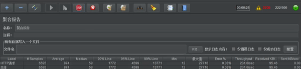
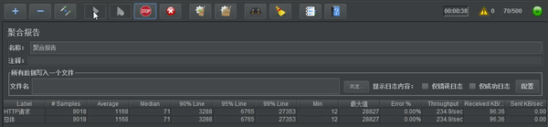

# 项目说明

该项目为自研《秒杀系统优化》项目，主要关注在性能优化方面：

- 技术栈：Spring Boot、rocketmq、Redis
- 优化点：
  - 硬件部署及配置优化
    - 云端部署
      - tomcat容器参数优化
      - 线程池优化
    - 分布式扩展
      - 水平扩展优化
      - 动静分离优化
      - 反向代理优化
      - 分布式会话优化
  - 过载保护优化
    - 流量削峰
      - 令牌分离优化
      - 闸门流量化
      - 队列泄洪
    - 防刷限流
      - 验证码优化
      - 令牌桶限流
  - 查询优化
    - redis缓存优化
    - 本地缓存优化
    - lua缓存优化
  - 交易优化
    - 交易验证优化
    - 缓存库存优化
    - 异步流程优化
    - 事务消息优化
    - 库存售罄优化

# 代码结构

- config：保存的是redis配置、tomcat的优化配置
- controller：控制器
- dao：mapper接口
- dataobject：do域对象
- error：错误管理对象
- mq：消息队列
- response：返回的封装对象
- serializer：序列化配置
- service：服务层
- util：验证码工具类
- valtdator：返回前端页面

# 未做任何优化前的TPS测试

- 服务器配置
  - 处理器和内存：1 vCPU 2 GiB
  - 网络：1Mbps
  - 线程组数：
    - 线程数：500
    - 循环次数：20



从图中可以看到，在500个线程数单机`tps`只有`219.3/sec`的吞吐量（这个吞吐量还会更低），同时已经出现请求错误的现象。

# tomcat容器参数优化

修改应用中的`application.properties`

```shell
# 等待队列长度
server.tomcat.accpet-count=1000
# 最大工作线程数
server.tomcat.max-threads=800
# 最小工作线程数
server.tomcat.min-spare-threads=100
```

- 线程组数
  - 线程数：500
  - 循环次数：20



通过修改了配置之后，终于把错误率消灭掉，但是程序的`tps`仍然很低，只有`161.9/sec`。

# 关键代码解释

- [RedisConfig](./md/RdisConfig.md)

