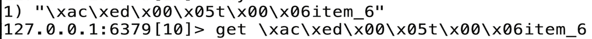
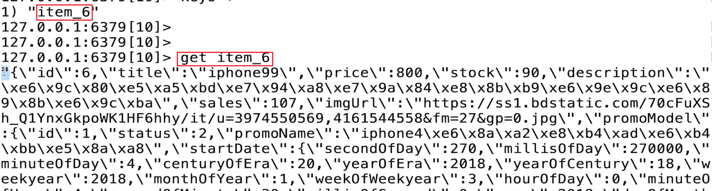
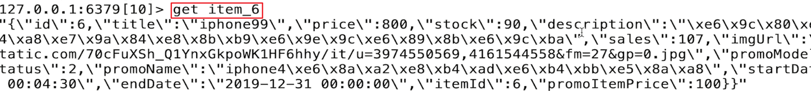

# RedisConfig

- `@EnableRedisHttpSession`：开启redis会话缓存

当直接使用redis存储会话的时候，有可能就会造成`key`、`value`变成二进制码：



所以在库当中，我们为了能够完善`key`和`value`的正常阅读，所以在代码中首先解决对应的`key`问题：

```java
// 首先解决key的序列化方式，让key不要以二进制的方式存到库中
StringRedisSerializer stringRedisSerializer = new StringRedisSerializer();
redisTemplate.setKeySerializer(stringRedisSerializer);
```

同时需要解决`value`的序列化问题：

```java
//解决value的序列化方式，主要是将值的序列化结果，改成json，不采用二进制形式存储
Jackson2JsonRedisSerializer jackson2JsonRedisSerializer = new Jackson2JsonRedisSerializer(Object.class);
redisTemplate.setValueSerializer(jackson2JsonRedisSerializer);
```

最后的运行结果已经得到正常的结果：



不过程序中使用了`jodatime`，所以就会造成结果中的时间字符串仍然很长，所以需要添加过滤module来进一步过滤结果，重新解析`jodatime`的格式为`YYYY-mm-ss`：

```java
ObjectMapper objectMapper = new ObjectMapper();
SimpleModule simpleModule = new SimpleModule(); // 这个module用于定制化
// 虽然已经正常序列化但是对应的joda时间
simpleModule.addSerializer(DateTime.class,new JodaDateTimeJsonSerializer());
simpleModule.addDeserializer(DateTime.class,new JodaDateTimeJsonDeserializer());
objectMapper.enableDefaultTyping(ObjectMapper.DefaultTyping.NON_FINAL);
// 注册对应的module
objectMapper.registerModule(simpleModule);
// 完成和template的绑定
jackson2JsonRedisSerializer.setObjectMapper(objectMapper);
```

同时要创建编码器和解码器：

```java
/**
 * joda解序列化
 */
public class JodaDateTimeJsonDeserializer extends JsonDeserializer<DateTime>
{
    @Override
    public DateTime deserialize(JsonParser jsonParser, DeserializationContext deserializationContext) throws IOException, JsonProcessingException {

        // 获取对应的字符串
        String dateString =jsonParser.readValueAs(String.class);
        // joda 按照 yyyy-MM-dd HH:mm:ss 来解字符串序列化
        DateTimeFormatter formatter = DateTimeFormat.forPattern("yyyy-MM-dd HH:mm:ss");
        // 获取对应的jodatime
        return DateTime.parse(dateString,formatter);
    }
}


/**
 * joda时间序列化方法
 */
public class JodaDateTimeJsonSerializer extends JsonSerializer<DateTime>
{

    @Override
    public void serialize(DateTime dateTime, JsonGenerator jsonGenerator, SerializerProvider serializerProvider) throws IOException {
        jsonGenerator.writeString(dateTime.toString("yyyy-MM-dd HH:mm:ss"));
    }
}
```

最后的结果：



